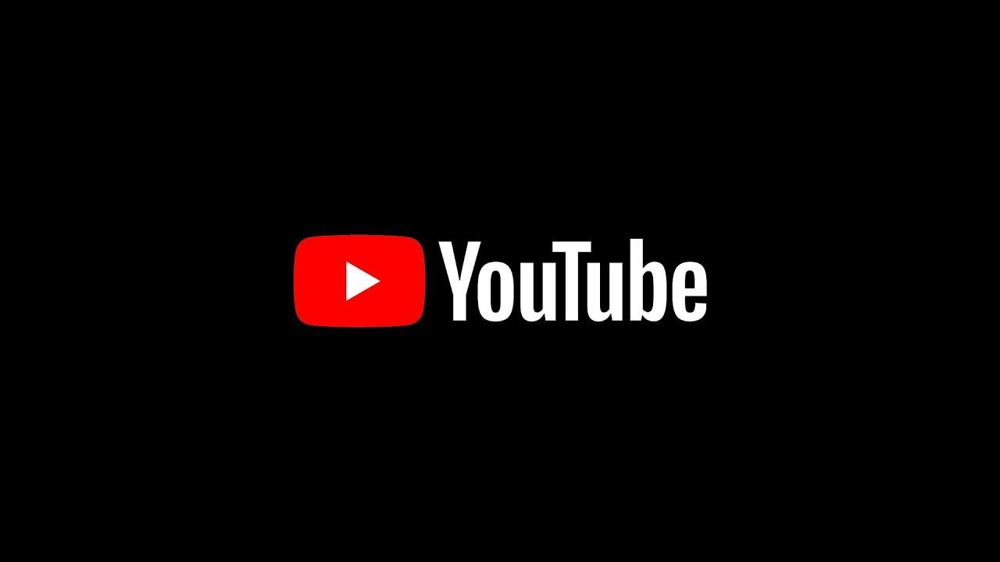

# Youtube scripts

Welcome to the scripts I have created in my [YouTube Channel](https://www.youtube.com/channel/UC4jmaY21ri9n3DteRwuoJaA?view_as=subscriber). Some things you have to know when opening this cool repo.

0. If you are a **recruiter**, don't expect this repo to have best practices. Files here are just a bunch of scripts/notebooks I make to explain simple concepts. I think it's cool that I record everything in at least one place.

1. I **stopped making videos in spanish**. Many subscribers still think I keep doing videos in spanish but that's not the case. I decided that by doing my videos in english I could potentially reach more people. Also if you want to be a good software developer, you should speak and write english correctly.

2. Nonetheless the scripts I made when I did my videos in spanish are in the `spanish-legacy` folder. Scripts are separated according to the programming language.

3. Now that points 1 and 2 are clear, I decided that putting random scripts in a repo is usually a bad idea, so sometimes I put codes in another single, independent repo if there is a lot of code. Otherwise, yes, you will find random scripts inside Jupyter Notebooks in the `notebooks` folder. I think their names are sufficient to describe what they do.

4. If those scripts are not in the `notebooks` folder, then they are probably in the `scripts` folder.
